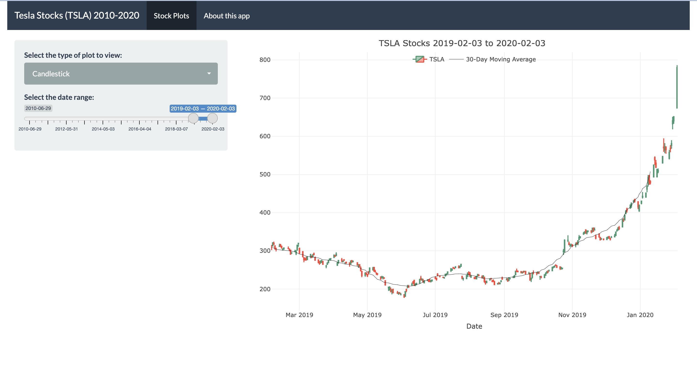

# teslastocks_app

This GitHub page contains the code for an interactive app showing different visualizations of Tesla stock (TSLA) changes for dates between 2010-2020. It also contains files for a presentation outlining the reproducible background of this Shiny app.

## Shiny interface
The interactive Shiny app can be found via this link: https://katiejchai.shinyapps.io/teslastocks_app/. A screenshot of the initial interface is shown below.

## Reproducibility presentation
To view the presentation HTML file as a webpage, visit the following link: https://katiejchai.github.io/teslastocks_app/.
